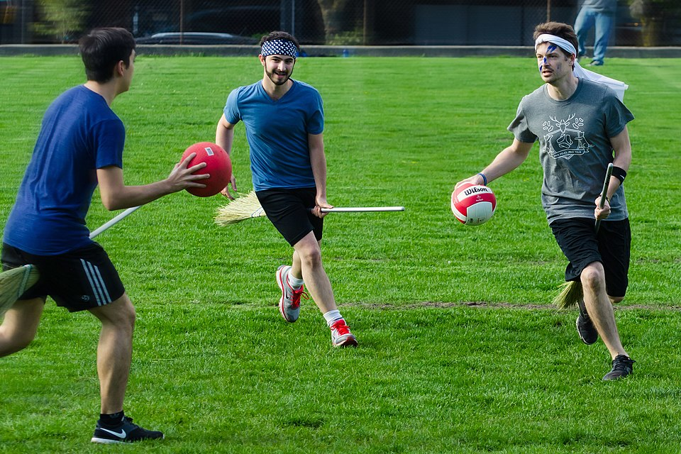
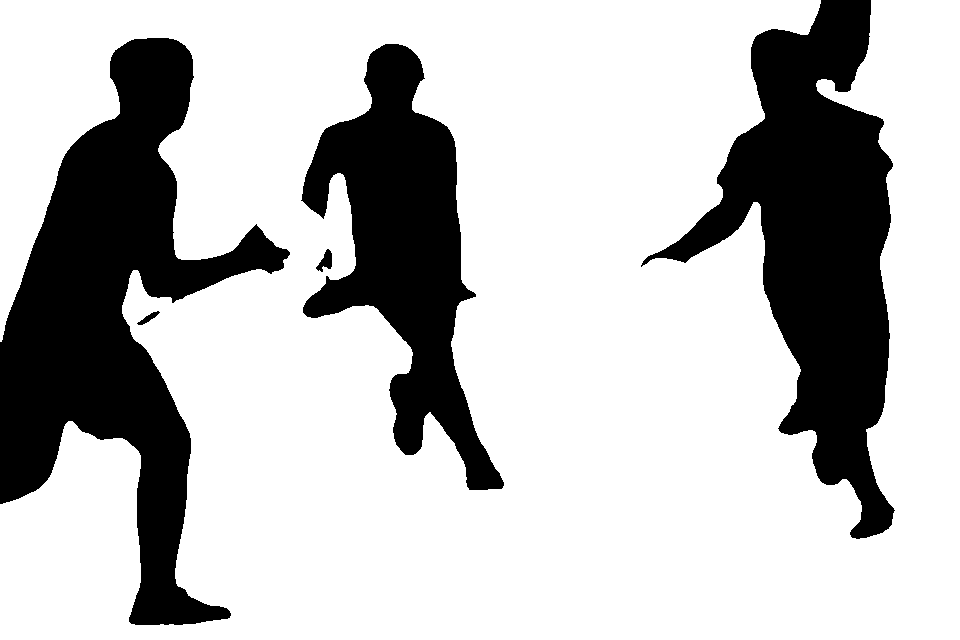
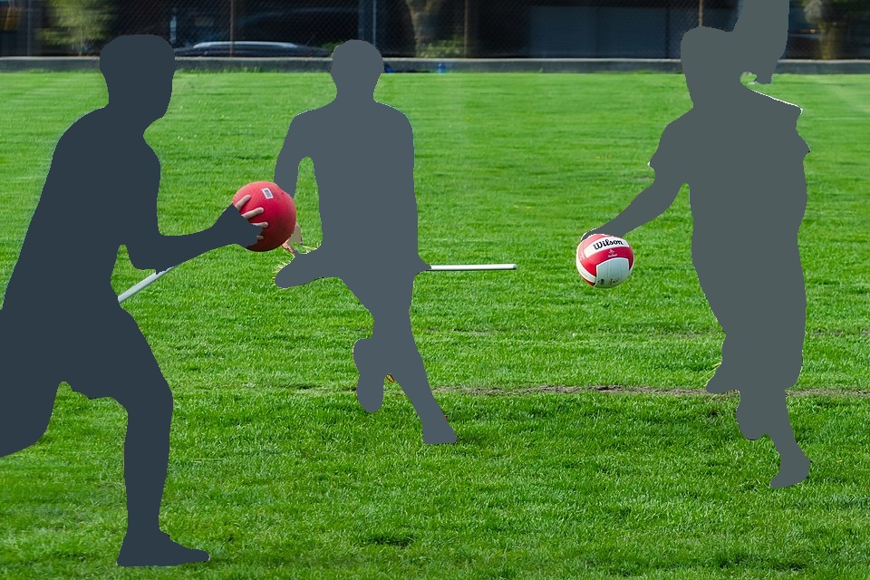
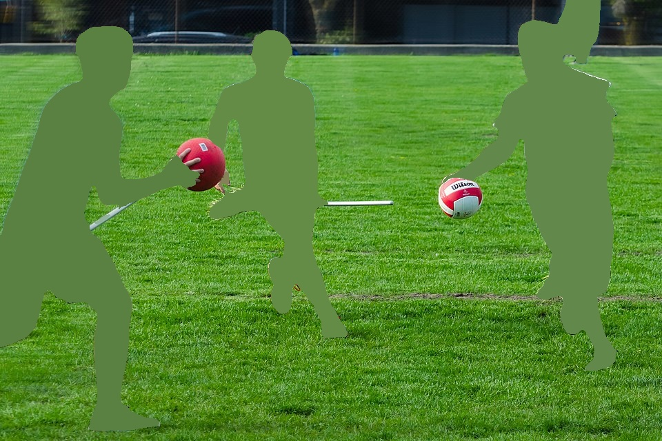
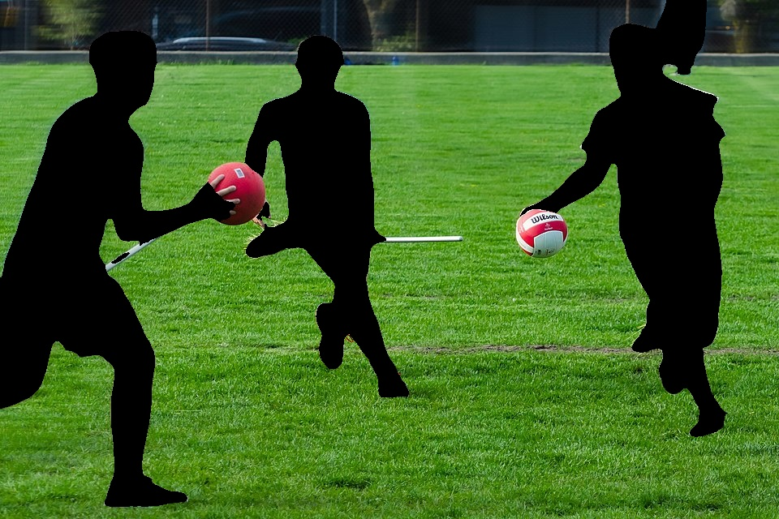
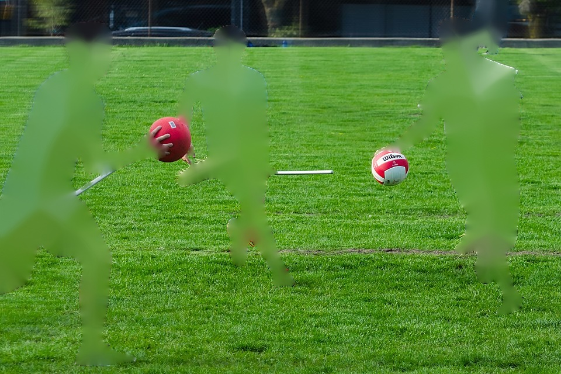
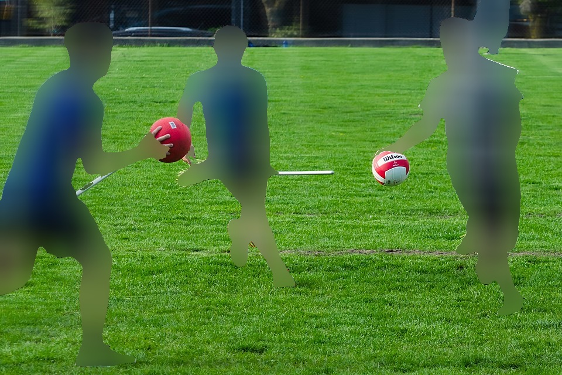
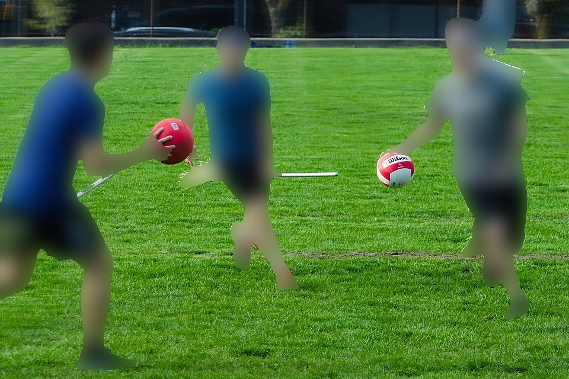

# An Easy-to-Use Image Masking and Anonymization Tool

What the tool does:
- Generates binary masks using semantic segmentation (e.g., for people, vehicles, sky, etc.).
- Can use the masks for anonymization.

In our experience, the available open anonymization tools (for faces, license plates, ...) are not very robust on real-world data and require a lot of manual interventions. This tool:
1. Masks entire people and vehicles (larger objects easier to segment).
2. Uses a union of masks from multiple off-the-shelf Mask2Former models (to limit failures of individual models).


## Installation

Torch, NumPy, and Hatchling are needed at build time. You can either install them manually and then install the `easy_anon` package, which defines the runtime dependencies:
```bash
pip install torch numpy hatchling
pip install git+https://github.com/spatial-intelligence-group/easy_anon.git --no-build-isolation
```
or you can use the complete (tested) environment defined in `requirements.txt` and then install just the `easy_anon` package:
```bash
pip install -r requirements.txt
pip install git+https://github.com/spatial-intelligence-group/easy_anon.git --no-build-isolation --no-deps
```

- :green_heart: Mask2Former is installed automatically as a dependency.
- :warning: Mask2Former needs CUDA installed on the system.
    - If your installation of the CUDA toolkit is not in `/usr/local/cuda`, you need to set the environment variable `CUDA_HOME` before installing Mask2Former.
- :bulb: We recommend using [uv](https://docs.astral.sh/uv/) and replacing the `pip` calls with `uv pip`. It's much faster!


## Usage

The tool does two separate things:
1. Generates masks using Mask2Former models.
2. Anonymizes images using the generated masks.

The most basic way to run the two is:
```bash
python -m easy_anon.mask <input_image_dir> <mask_dir>
python -m easy_anon.anon <input_image_dir> <mask_dir> <anonymized_image_dir>
```


### Generating masks

|  |  |
|:-----------------------:|:-----------------------:|
|  |  |
| **input image (by [Anton Bielousov](https://commons.wikimedia.org/wiki/File:Muggle_Quidditch_Game_in_Vancouver.jpg) [CC BY-SA 3.0](https://creativecommons.org/licenses/by-sa/3.0/deed.en))** | **generated mask** |

The parts of the image that are masked can be specified using the `--labels` argument. Current options contain labels for people (`person`), vehicles (`vehicle`), sky (`sky`), and more. These are groups of segmentation IDs of the individual Mask2Former models, which are defined in the labels config files in [`src/easy_anon/configs`](src/easy_anon/configs). Multiple label groups can be used at once (just specify a list of the label groups `--labels person vehicle`). New label groups can be specified by changing the config files - just clone the repository, adjust the config files, and install the package from the local copy (`pip install <path to the cloned repo>`).

Mask2Former models used for the segmentation can be specified using the `--model` argument. Multiple models can be used at once (just specify a list of the model names `--model ADE20k-ResNet101 ADE20k-Swin-L-IN21k`). By default, the union of individual masks (from different models) is used to generate the final mask. The models should be automatically downloaded when used for the first time.

Use help to get all the available options:
``` bash
python -m easy_anon.mask --help
```


### Anonymizing images

The way how the masked areas are filled in can be specified with the `--infill_mode` argument. The available options are:

|  |  |
|:-----------------------:|:-----------------------:|
|  |  |
| **average color in the masked area**<br>`average_inside` | **average color on the mask border**<br>`average_border` |
|  |  |
| **single specified color**<br>`single_color` | **inpainted by [\[Telea, 2004\]](https://doi.org/10.1080/10867651.2004.10487596)**<br>`inpaint` |
|  |  |
| **blurred with box filter**<br>`blur_box` | **blurred with Gaussian filter**<br>`blur_gauss` |

The color for the `single_color` infill mode can be specified using the `--single_color` argument (supports alpha). The blurring and inpainting can be adjusted with the `--size_param` argument.

Use help to get all the available options:
``` bash
python -m easy_anon.anon --help
```


## Citing

If you use the tool in your scientific work, please cite it as:

```BibTeX
@misc{easyanon,
  title = {{easy-anon - An Easy-to-Use Image Masking and Anonymization Tool}},
  author = {Vojtech Panek and contributors},
  URL = {github.com/spatial-intelligence-group/easy_anon},
  year = {2025}
}
```

Please also cite the Mask2Former line of work:

```BibTeX
@inproceedings{cheng2021mask2former,
  title={Masked-attention Mask Transformer for Universal Image Segmentation},
  author={Bowen Cheng and Ishan Misra and Alexander G. Schwing and Alexander Kirillov and Rohit Girdhar},
  journal={CVPR},
  year={2022}
}

@inproceedings{cheng2021maskformer,
  title={Per-Pixel Classification is Not All You Need for Semantic Segmentation},
  author={Bowen Cheng and Alexander G. Schwing and Alexander Kirillov},
  journal={NeurIPS},
  year={2021}
}
```

The `inpaint` infill uses the algorithm from:

```BibTeX
@article{telea2004image,
  title={An Image Inpainting Technique Based on the Fast Marching Method},
  author={Telea, Alexandru},
  journal={Journal of graphics tools},
  volume={9},
  number={1},
  pages={23--34},
  year={2004},
  publisher={Taylor \& Francis}
}
```

## License

This project is licensed under the MIT License - see the [LICENSE](LICENSE) file for details. Also, check the [NOTICE](NOTICE) file for additional information.


## Acknowledgements

This project uses:
- [Mask2Former](https://github.com/facebookresearch/Mask2Former) for semantic segmentation
- [OpenCV](https://opencv.org/) for image processing
- [Rich](https://github.com/Textualize/rich) for CLI
- and otters